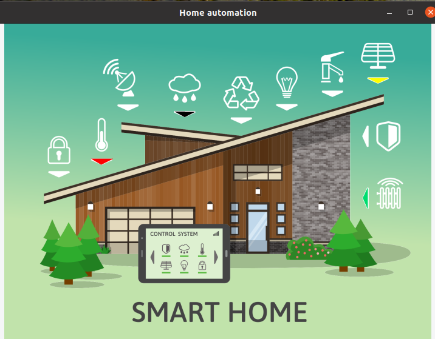
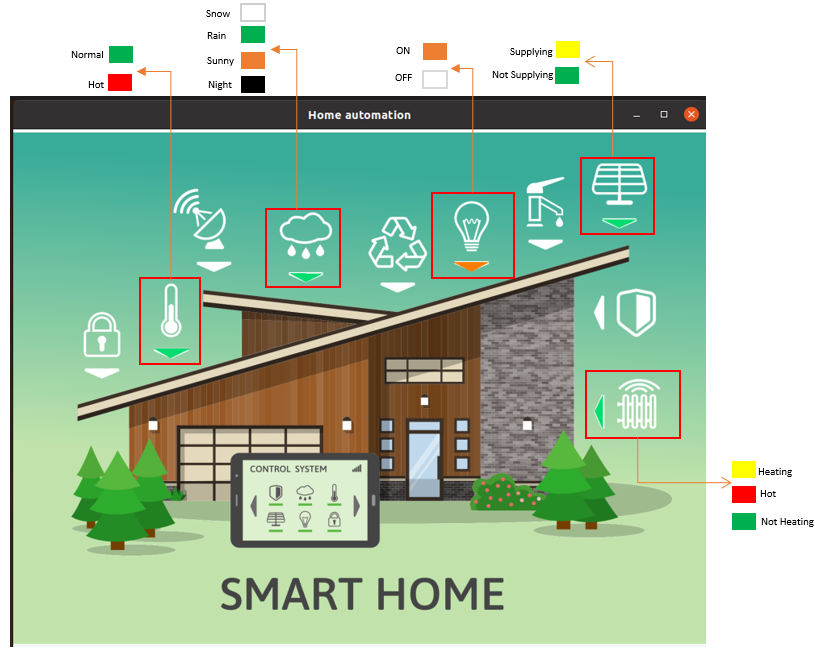

# Simulation of a Smarthome Automation
This repository contains the final capstone project from my Udacity Nanodegree program in C++. The project implemented is a Simulation of a smart home automation system for weather, automatic switch ON and OFF of the lighting in the home, and control of the Temperture sensor and heater based on the weather condition.



# Dependencies for Running
The code compiled without any issues on the following versions
- Linux 5.8.0-48-generic
- Gnu Make version: 4.2.1
- Cmake version: 3.16.3
- OpenCV >= 3.0 
    - For installation procedure used for opencv use [OpenCV Installation](https://docs.opencv.org/master/d7/d9f/tutorial_linux_install.html)
- gcc/g++ version: 9.3.0

**Note:** The OpenCV Installation procedure also explains how cmake and the gnu toolchain dependencies for the project can be installed.

# Project Build Instruction
1. Clone this repository
2. Create a build Directory using: ```mkdir build && cd build ```
3. Compile with ``` cmake .. && make```
4. Run code: ```./smarthome ```

# Project Description


### The project simulates: 
 1. Three weather conditions which are: *Rainy, Snowy, Sunny*.
 2. Time: *Day and Night*
 3. Energy Supply: *Supplying and Not Supplying(Full)*.
 4. Temperature Monitor: *Hot and Nomal*
 5. Heater: *Heating, Hot, and Not Heating*

 The weather condition controls the Temperature effect.
 

 1. **When Raining(Green)**: The Temperature is Normal(Green) which was set at 15 degrees. The Heater is not heating and the Energy is continiously supplied till it gets full. The Time is been monitored and once it is 18th second, the light switches on. It Switches back off at 24th second. The different color shown above shows the states as explained.

 2. **When Snowing(White)**: The Temperature is being decremented but also the heater comes on to increase the temperature to a set point assumed to be 24 degrees. During the heating, the colour is yellow till it is fully hot(Red) at 24 degrees. At 24 degrees, the temperature monitor changes to Red to indicate that the room is hot.
 
 3. **When Sunny(Orange)**: The Temperature increases to 30 degrees and at 24 degrees, the temperature monitor turns Red. The Heater does not come on and stays at green. The weather indicator turns Black at 18 Seconds to indicate Night time and there should not be sun. It comes back after ther 24th second
 
 **Note**: 
 * Currently, the Energy Supply is independent of the weather conditions. Also the 
 * Weather indicator only changes to black when simulating for Sun.
 * Time of the day assumes Seconds to give quich effect.
 * Weather simulated effect is set to 5 seconds cycle time.
 * Energy is set to a value that can get filled up to notice the simulation states.

 At startup user should Enter the Effect he/she wants to simulate. Three options are possible.

 1. Snow.
 2. Rain.
 3. Sun.

## Simulation procedure

Wrong option keeps you at the prompt instruction till correct option is entered. If wrong option is entered, the objects blick a red color. If correct, then a green color flashes at all object indicator and then the code starts simulating the entered option.

## Effects.
Effects of the display can be read from what is being displayed on the console.

# Code Structure
The project Directory contains **inc/, src/** child directory, the CMakeLists.txt file and Picture used to Simulate the project. The inc/ folder containes the include .h files and src/ contains the .cpp files. 

 
The main.cpp file is the entry point of the program. It creates an instance of the classes used and spins up a thread to simulate each effect. Also the input from the user was implemented here. 


The energy.h and .cpp was implemented in an OOP format with member method  ```void SupplyEnergy()``` to supply Energy, ```void PrintEnergy()``` to print current energy value. **Note**: Energy value is assumed in kilowattseconds(KWS) instead of Kilowatthour(KWH). ```unsigned int GetEnergy()``` Gets the current Energy. ``` void simulate() ``` simulates the effect on its own thread. _energy was declared static to give a unique shared value of Energy accross threads where it was used.

The graphics.h and .cpp was Implemented in OOP form. This is where the function that displays the background image was implemented. The method ```void BackgroundSimulate()``` displays the background image with the shapes to indicate objects states. The Class method ```void points_init()``` initialises the shapes and push it into a vector. The ```void SetColor(int loc, Color color)``` Sets the different color of the shapes. ```void TimeofDaySimulation()``` simulates the time effect in seconds and is given its own thread. ```Background& operator=(const Background &RHS)``` currently not used.

The heater.h and .cpp was implemented in OOP form. This Class uses the method ```void StartHeating(unsigned int heater_consp)``` to start the heater and the argument indicates the energy consumption rate.  The member method ```void Simulate()``` simulates the effect on a thread.

The light.h and .cpp also uses OOP and the method ```state LightControl(state l_control)``` controls turning on and off the light. ```void simulate()``` simulates the turning on and off of the light on a different thread.

The lock.h and .cpp was not implemented in OOP form. These are just functions to create the illusion of lock and unlock mechanism if wrong entry of weather is selected. Functions used are ```void lock(Background& background)``` and ```void unlock(Background& background)```.

In the weather.h and .cpp file, the weather effect was implemented here. It was implemented in an OOP form. The member method ```bool Incr_Temp(const unsigned int conditionvalue, const unsigned int incr_val)``` and ```bool Decr_Temp(const unsigned int conditionvalue, const unsigned int decr_val)``` increases and decreases the temperature. The arguments conditionvalue is used to set the point the max and min increase or  decrease the temperature, while incr_val and decr_val sets the rate of increase and drecrease respectively. ```void update()``` used to check the current temperature inorder to set the monitor. ```void print()``` priints the value of the temperature. The ```unsigned int get_Temp() const``` gets the current temperature. The member method ```void change()``` implements the weather variation effect. The method ```void simulate()``` simulates the effect of the implemetation on its own thread.

The constructors of each file was used to initialize the different colours at start time. Also to implement a class aggregation relationship amongst some of the classes.

# Information about Rubic & Criteria
- README 
    - All Rubric Points under these section achieved. 
- Compiling and Testing
    - Program compiles with cmake and make without errors.
- Loops, Functions, I/O
    - The project demonstrates an understanding of C++ functions and control structures.
        used accross files.
    - The project reads data from a file and process the data.
        used to read image at graphic.cpp in opencv method
    - The project accepts user input and processes the input.
        - used at main.cpp
- Object Oriented Programming
    - The project uses Object Oriented Programming techniques.
        - used across files.
    - Class constructors utilize member initialization lists.
        - used accross files.
    - Classes encapsulate behavior.
        -  used accross files. 
- Memory management
    - The project makes use of references in function declarations. 
        - used References accross the files in passing objects to a a class.
    - The project uses smart pointers instead of raw pointers.
        - used shared pointer at main.cpp.
- Concurrency
    - The project uses multithreading.
        - used at main.cpp.
    - A mutex or lock is used in the project.
        - used at weather.cpp, graphics.cpp and energy.cpp.
    - A condition variable is used in the project.
        - used at energy.cpp.

**Disclaimer**:

1. This Project was not implemented to time precision but just to display understanding of C++ concepts.
2. Picture used was gotten from [this website](https://freedesignfile.com/?cat=1&s=Smart+home)